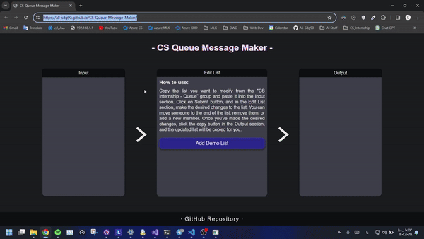

# CS-Queue-Message-Maker

**CS-Queue-Message-Maker** is a specialized tool designed for the CS Internship program to manage and update queue messages efficiently. It provides a simple and intuitive interface for creating, editing, and exporting queue messages, ensuring consistent formatting and error-free ordering.  

> For background on the motivation behind this tool, see [this Telegram post](https://t.me/mentor_world/438).



## Project Overview

CS-Queue-Message-Maker streamlines queue management for the CS Internship program. It allows admins to maintain an ordered list of participants, customize message formats, preview updates in real time, and export them for sending to groups. The tool ensures that queue updates are accurate and consistent, reducing manual effort and mistakes.

## Features

- Add, edit, and remove queue members  
- Customize message formats for output  
- Real-time preview of queue messages  
- Export messages to various formats  
- Responsive and user-friendly interface  
- Supports Persian fonts and RTL layouts  
- Backup and restore queue data  

## Technologies Used

- **TypeScript**  
- **JavaScript (ES6)**  
- **HTML5**  
- **SCSS/CSS**  

## Installation Instructions

> **Prerequisites:**  
> - A modern web browser  

Clone the repository:

```bash
git clone https://github.com/Ali-Sdg90/CS-Queue-message-maker.git
cd CS-Queue-message-maker
```

Open `index.html` in your browser to start using the tool.  
No server setup is required; open the index.html directly in your browser.

## Folder/File Structure

```
CS-Queue-message-maker/
│
├── Assets/
│   ├── backup/           # Backup files for queue data
│   ├── fonts/            # Font files (Vazirmatn)
│   └── imgs/             # Images and icons
│
├── JS/                   # Compiled JavaScript files
├── TS/                   # TypeScript source files
│   ├── addNewMember.ts        # Add new members to the queue
│   ├── convertInput.ts        # Parse and convert input data
│   ├── customScaleCalc.ts     # UI scaling calculations
│   ├── demoList.ts            # Demo/sample queue data
│   ├── index.ts               # App entry point and main logic
│   ├── memberActionBtns.ts    # Member action button logic
│   └── output.ts              # Generate and format queue output
├── Style/                # SCSS and CSS stylesheets
├── index.html            # Main HTML entry point
├── LICENSE               # License file
└── README.md             # Project documentation
```

## Contribution Guidelines

1. Fork the repository  
2. Create a new branch (`git checkout -b feature/your-feature`)  
3. Commit your changes (`git commit -am 'Add new feature'`)  
4. Push to your branch (`git push origin feature/your-feature`)  
5. Open a Pull Request describing your changes  

> Follow the existing code style and include tests or demos if applicable.

## License

This project is licensed under the [MIT License](LICENSE).

## Contact / Author Info

- **Author:** [Ali Sadeghi](https://github.com/AliSdg90)  
- **Developed for:** [CS Internship Program](https://github.com/cs-internship)

