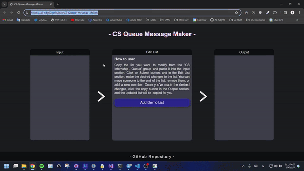

<h1>CS-Queue-Message-Maker📋</h1>

    Hello! A year ago, I was in the queue for a
    web development course for #CS_Internship program, observing the group
    admins sending updates to the queue every week. I always thought there must
    be a professional tool to organize and arrange the queue efficiently. I
    joined the mentors' group, and now I was the admin sending queue updates. It
    seemed strange to me that this process was entirely manual, with no tool
    available for it. I realized that if I were asked to move someone from the
    front to the end of the queue, I would need to manually adjust the numbers
    of everyone behind them, ensuring no mistakes are made, and the spacing is
    consistent.

    A few weeks ago, I dedicated time to developing a solution for this issue,
    and now the project is complete. The program is named
    CS-Queue-Message-Maker, designed to streamline the process of creating queue
    updates. The program has a simple interface, and you can easily understand
    how to use it by reading the included "How to use" guide within the program.

<h2>How to Use CS-Queue-Message-Maker:</h2>
<ol>
    <li>
        
<strong>Access the live version of the program:</strong>

        <ul>
            <li>
                To start, access the live version of the program using
                <a
                    target="_new"
                    href="https://ali-sdg90.github.io/CS-Queue-Message-Maker/"
                    >this link</a
                >.
            </li>
        </ul>
    </li>
    <li>
        
<strong>Copy the desired queue:</strong>

        <ul>
            <li>
                Copy your desired queue from the "CS Internship - Queue" group.
            </li>
        </ul>
    </li>
    <li>
        
<strong>Paste into the Input box:</strong>

        <ul>
            <li>
                Paste the copied content into the Input box and click the Submit
                button.
            </li>
        </ul>
    </li>
    <li>
        
<strong>Edit List Features:</strong>

        <ul>
            <li>
                In the Edit List box, each member has a row containing their
                queue number, full name, Telegram ID, and two buttons to change
                the person's position in the queue.
            </li>
        </ul>
    </li>
    <li>
        
<strong>Change Member Positions:</strong>

        <ul>
            <li>
                Downward arrow button: Moves the member to the end of the queue.
            </li>
            <li>X button: Removes the member from the queue.</li>
        </ul>
    </li>
    <li>
        
<strong>Add a New Member:</strong>

        <ul>
            <li>
                In the green box at the bottom of the Edit List, enter the name
                and Telegram ID of the new member and click the Add button to
                add them to the end of the queue.
            </li>
        </ul>
    </li>
    <li>
        
<strong>Click the Copy button and Save the Update:</strong>

        <ul>
            <li>
                After making changes, click the Copy button in the Output box to
                save the updated queue text to the clipboard.
            </li>
        </ul>
    </li>
    <li>
        
<strong>Paste into the Queue Group:</strong>

        <ul>
            <li>
                Paste the updated queue text into the "CS Internship - Queue"
                group.
            </li>
        </ul>
    </li>
</ol>

Happy queuing! 🚀✨

